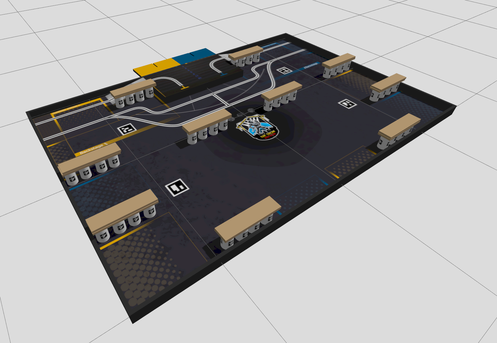

This repository is for the second revision or the ezBot robot that can be seen at [insert link of ensmasteel's repo]
Here can be found ROS2 humble nodes, launch files, and simulation tools for the new robot.
To see the elctronics design, see [insert other repository].
For the CAD design, see [insert catia repository]


For the simulation, the following dependencies need to be installed :
`nvidia-container-toolkit`

# Running the simulation



[Docker](https://docs.docker.com/engine/install/) and [nvidia-container-toolkit](https://docs.nvidia.com/datacenter/cloud-native/container-toolkit/latest/install-guide.html) are supposed to be installed on the host machine.

Clone the repository and build the docker image :
```bash
xhost +local:* 
git clone https://github.com/VincidaB/ezBotV2.git
cd ezBotV2
./docker/build-all.sh
./docker/run.sh
```

Inside of the container : 

```bash
colcon build --symlink-install
source install/setup.bash
ros2 launch ezbot-v2-simulation multirobot-simulation.launch.py
```
or for a single robot simulation :
```bash
ros2 launch ezbot-v2-simluation simulation.launch.py
```


> **Note &#9432; :** for systems with low RAM (<16Gb), it is recommended to compile using `colcon build --symlink-install --executor sequential` to avoid running out of memory.
